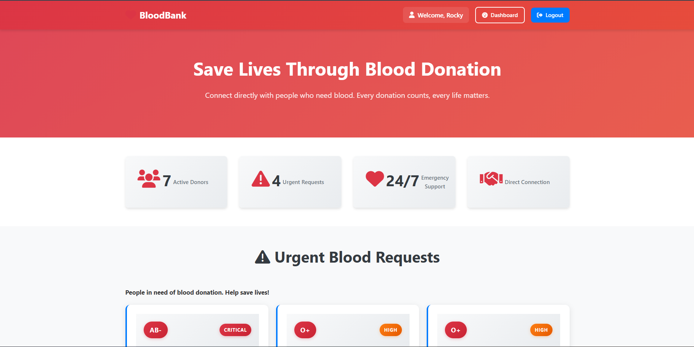
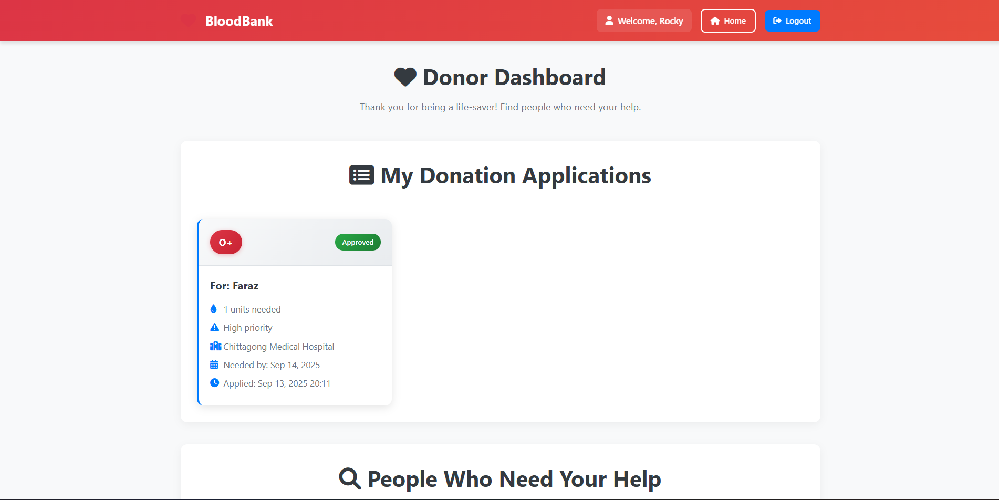
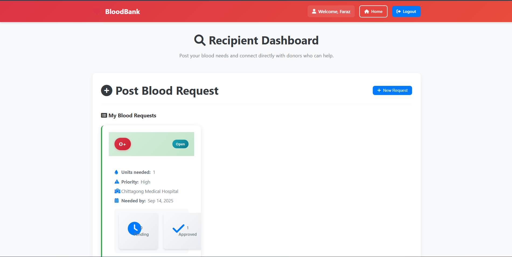

BloodBank

BloodBank is a web-based peer-to-peer blood donation platform developed as part of the Database Management Systems (DBMS) course during the 4th semester.
The system connects blood donors and recipients directly, enabling efficient blood requests, donation applications, and real-time tracking through individual dashboards.

🌐 Live Demo

Check out the live version of BloodBank: [BloodBank](https://dms-bloodbank.42web.io/)

(Replace with your hosted link if available.)

🚀 Features

User authentication system (Donor / Recipient roles)

Donor and recipient role-based dashboards

Blood request posting for self or others

Donation application system (peer-to-peer)

Recipient can review and accept donor applications

Donors can view active blood requests and apply

Dashboard-based monitoring of requests and donations

Secure database-driven workflow

💻 Technologies

Frontend: HTML, CSS, JavaScript

Backend: PHP

Database: MySQL

Tools & Environment: XAMPP, phpMyAdmin

🏗 Installation

Clone the repository:

git clone https://github.com/SalmanJubayeed/BloodBank.git

Start XAMPP (Apache & MySQL).

Import the SQL file from the sql/ folder into phpMyAdmin.

Place the project folder inside htdocs.

Open in browser:

http://localhost/BloodBank

📁 Project Structure

index.php – Landing page

register.php – User registration (Donor / Recipient)

login.php – User login

dashboard.php – Role-based user dashboard

post_request.php – Blood request posting

apply_donation.php – Donation application

manage_requests.php – Request & donation management

css/ – Stylesheets

sql/ – Database schema and sample data

📸 Screenshots

Landing page of the BloodBank system.

Donor dashboards.

Recipient dashboards.

🙌 Acknowledgments

Developed as part of the Database Management Systems course

Guided by course instructors and academic resources

⚡ Project Status

Core donor–recipient workflow fully functional

Blood request and donation application system implemented

Dashboard-based monitoring working

Developed under semester timeline constraints; scope limited to core DBMS concepts
